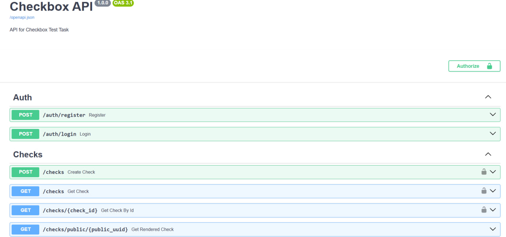

# Checkbox API Test Task

## Description
This is a test task for a Checkbox API. The task is to create a simple API that allows users to manage checkboxes. The API should support the following operations:
- Create a new checkbox [POST]
- Get a list of all checkboxes for current authenticated user [GET]
- Get a specific checkbox by ID [GET]
- Get rendered HTML for a specific checkbox [GET]

You can learn more about the API by looking at the code in documentation in Swagger. You can find the documentation at `http://{APP_HOST}:{APP_PORT}/docs` after running the application. Also you can use redoc to view the API documentation at `http://{APP_HOST}:{APP_PORT}/redoc`.


## Installation
1. Clone the repository
   ```sh
      git clone <repository-url>
      cd <repository-directory>
    ```
2. Install Poetry if you don't have it installed
   ```sh
   curl -sSL https://install.python-poetry.org | python3 -
   ```
3. Install dependencies
   ```sh
    poetry install
    ```
4. Create a `.env` file in the root directory with the following content as in the `.env.template` file
5. Apply migrations
    ```sh
    poetry run alembic upgrade head
    ```
6. Start the server
    ```sh
    poetry run uvicorn src.main:app --host {APP_HOST} --port {APP_PORT} --reload
    ```

## Installation [with Docker]
1. Clone the repository
   ```sh
      git clone <repository-url>
      cd <repository-directory>
    ```
2. Create a `.env` file in the root directory with the following content as in the `.env.template` file
3. Build the Docker image
   ```sh
   docker compose up
   ```

## Testing
1. Run tests
   ```sh
   poetry run pytest
   ```


## Testing [with Docker]
1. Build the Docker image
   ```sh
   docker compose up --build
   ```
2. Run tests
   ```sh
    docker compose exec app pytest
    ```
   